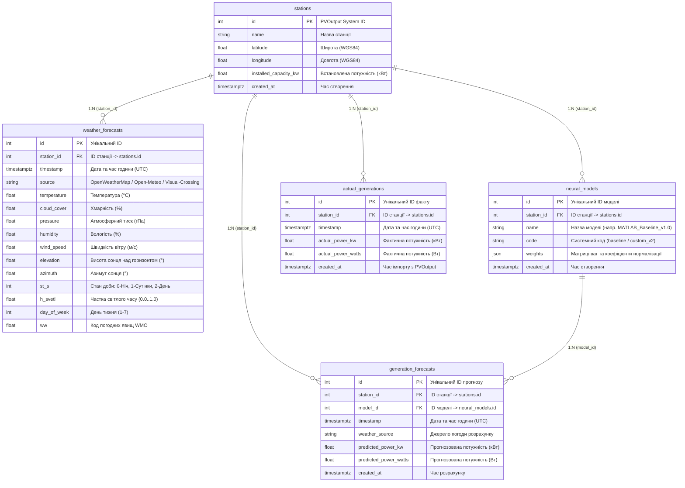

# ☀️ Solar Forecast System

## Інфраструктура

* **Frontend:** [Vercel](https://vercel.com)
* **Backend:** [Render](https://solar-forecast-system.onrender.com) (API Docs: [solar-forecast-system.onrender.com/docs](https://solar-forecast-system.onrender.com/docs))
* **Database:** [Neon](https://neon.tech)

> **Режим сну:** Через особливості безкоштовного тарифу Render бекенд засинає після 15 хвилин неактивності. Перший запит після простою може займати до 1 хвилини.

## Технологічний стек

* **Backend:** Python 3.12+, FastAPI
* **Frontend:** Angular 22.x
* **Database:** PostgreSQL 16+

## Структура бази даних

